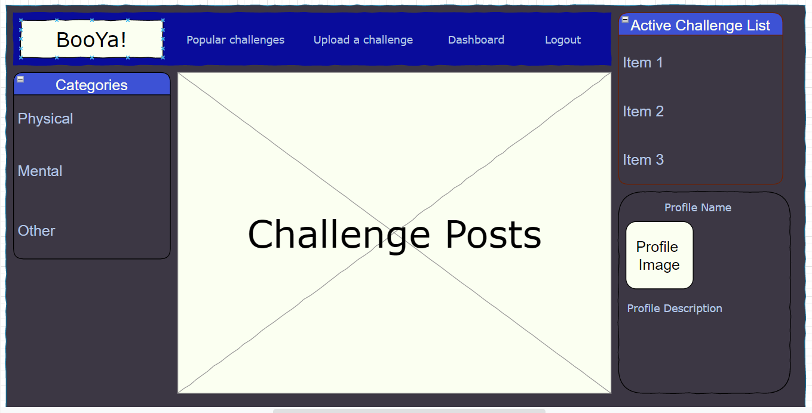

# UNH-Project-2

BooYa!

Gerard Kasemba
Samantha Doherty
Casen Luck
Troy Allen

## Project Description

The purpose of this application is to create a social media site allowing users to post and view challenges
posed by other users.  The user can log in to the system and see challenges (Physical, Mental, or Other) and 
complete them.  These challenges could be as simple as "10 pushups in the morning" or as daunting as "1 pullup in the morning".

Upon completing challenges the user will have a running score tallied and be able to follow other user's scores.  The user
will also have the opportunity to upload an image or short video of their completed challenge.

## User Story
    AS A USER I want to be able to post, view and accept challenges posed by other users.
        AND be able to complete and interact with other challenges.
    AS A USER I want to be able to track challenges i've completed and be able to view other
        users completed challenges
    AS A USER once I complete a challenge I want to see the points awarded added to my running total.

## Breakdown of Tasks

API - Troy Allen
Front End - Samatha Doherty
Database - Casen Luck
Gerard Image Stuff

## Wireframe and Tables

    ### Tables
    #### User
        -id
        -password
        -name
        -score

    #### Challenge
        -id
        -name
        -user_id (ref: user.id)
        -create_at (automatically made)
        -score

    #### Accepted
        -user_id
        -challenge_id
        -expires_at 

    #### Completed
        -user_id
        -challenge_id
        -link to media

## Link to project
